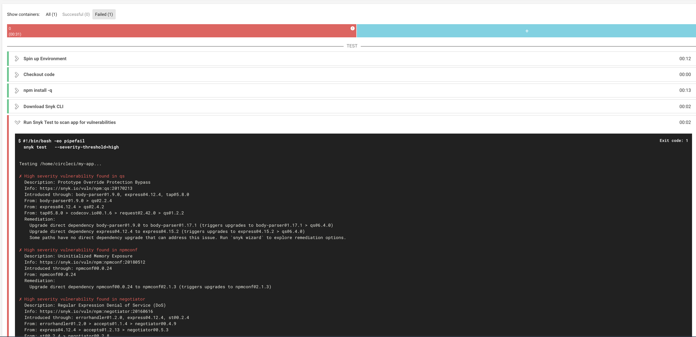
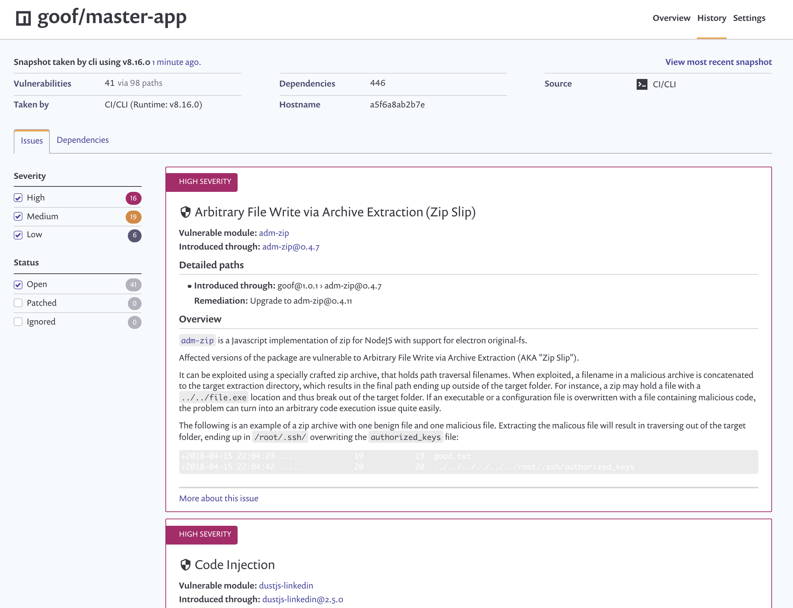
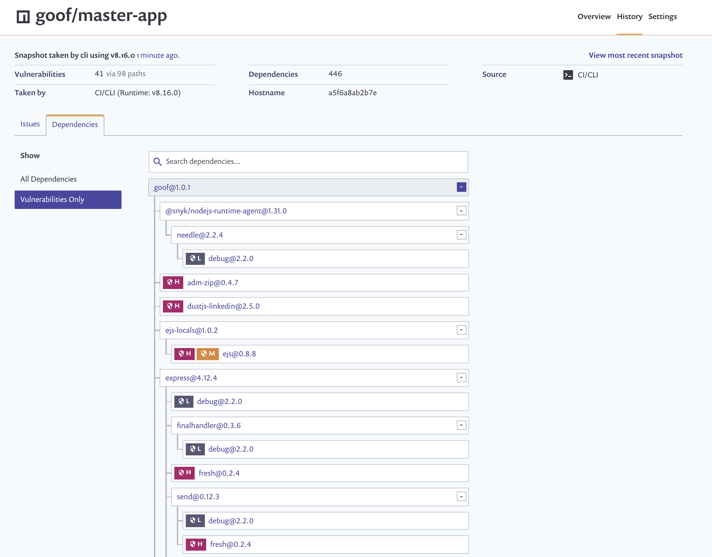

# Snyk Orb for CircleCI

## The Snyk Orb

Use the Snyk orb to easily incorporate [Snyk](https://snyk.co/udBRL) into your CircleCI Workflows.
By utilizing this orb in your project workflow, it is possible to use Snyk to test, fix and monitor your project for vulnerabilities in the app dependencies and Docker images, all with a single command. You can set thresholds for vulnerability tolerance in your app or Docker image (and fail the workflows when threshold is exceeded), apply proprietary Snyk patches, and save dependency snapshots on snyk.io for continuous monitoring and alerting.

## How to use the Snyk Orb

In fact, it is very easy to start using the Orb.
All you need to do is:

1. Follow the instructions at the
   [Orb Quick Start Guide](https://circleci.com/orbs/registry/orb/snyk/snyk#quick-start)
   to enable usage of Orbs in your project workflow
2. Set up an environment variable (`SNYK_TOKEN`) with your Snyk API token, which
   you can get from your [account](https://snyk.co/udBRK)
3. In the app build job, call the `snyk/scan`
4. Optionally, supply parameters to customize orb behaviour

## Usage Examples

### Scan App Dependencies

```yaml
version: 2.1

  orbs:
    snyk: snyk/snyk@x.y.z

  jobs:
    build:
      docker:
        - image: circleci/node:4.8.2
      steps:
        - checkout
        - run: npm install -q
        - snyk/scan
```

### Scan Docker Image

```yaml
version: 2.1

orbs:
  snyk: snyk/snyk@x.y.z

jobs:
  build:
    environment:
      IMAGE_NAME: myrepo/myapp
    docker:
        - image: circleci/buildpack-deps:stretch
    steps:
      - checkout
      - setup_remote_docker
      - run:
          name: Build Docker image
          command: docker build -t $IMAGE_NAME:latest .
      - snyk/scan:
          token-variable: SNYK_TOKEN
          docker-image-name: $IMAGE_NAME:latest
          target-file: "Dockerfile"
```

### Advanced Example

```yaml
version: 2.1

orbs:
snyk: snyk/snyk@x.y.z

jobs:
build:
    docker:
    - image: circleci/node:4.8.2
    steps:
    - checkout
    - run:
        command: npm install -q
    - snyk/scan:
        token-variable: CICD_SNYK_TOKEN                           # use is api token stored in an env variable named other than SNYK_TOKEN
        severity-threshold: high                                  # only fail if detected high-severity vulnerabilities
        fail-on-issues: false                                     # don't fail even if issues detected (not recommended!)
        monitor-on-build: true                                    # create a snapshot of apps dependencies on snyk.io, for continoues monitoring (recommended!)
        project: ${CIRCLE_PROJECT_REPONAME}/${CIRCLE_BRANCH}-app  # use this to save the snapshot under specific names.
        organization: ${SNYK_CICD_ORGANIZATION}                   # save reports under a specific Snyk organization
        no-output-timeout: 20m                                    # set timeout without output to 20 mins
```

## Orb Parameters

Full reference docs https://circleci.com/orbs/registry/orb/snyk/snyk

| Parameter  | Description | Required | Default | Type |
| -----------| -------------------------------------------------------------------------------------------------------- | ------------- | ------------- | ------------- |
| command | The CLI command (i.e. "test", "iac test") to execute | no | test | string |
| token-variable | Name of env var containing your Snyk API token | no | SNYK_TOKEN | env_var_name |
| severity-threshold | Only report vulnerabilities of provided level or higher (low/medium/high/critical) | no | low | low \| med \| high \| critical |
| fail-on-issues | This specifies if builds should be failed or continued based on issues found by Snyk | no | true | boolean |
| monitor-on-build | Take a current application dependencies snapshot for continuous monitoring by Snyk, if test was succesful | no | true | boolean |
| target-file | The path to the manifest file to be used by Snyk. Should be provided if non-standard | no | - | string |
| docker-image-name | The image name, if scanning a container image | no | - | string |
| organization | The Snyk Organization ID (see Organization-level Settings tab in the Snyk UI) under which this project should be tested and monitored. | no | - | string |
| project | A custom name for the Snyk project to be created on snyk.io | no | - | string |
| additional-arguments | Refer to the Snyk CLI help page for information on additional arguments | no | - | string |
| os | The CLI OS version to download | no | linux | linux \| macos \| alpine |
| install-alpine-dependencies | For the alpine CLI, should extenral dependencies be installed | no | true | boolean |
| no-output-timeout | Elapsed time the command can run without output. The default is 10 minutes | no | 10m | string |

## Screenshots

### Snyk found high-severity vulnerabilies in app and failed the workflow



### Continuous Monitoring on snyk.io

#### Issues Report



#### Dependency Tree


